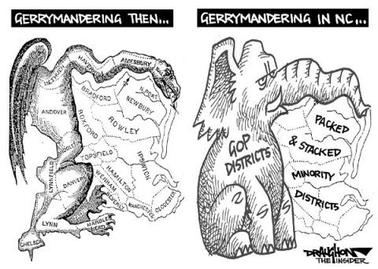

As the [Supreme Court decision on Wisconsin gerrymandering](http://www.npr.org/2017/10/03/555425809/supreme-court-set-to-consider-partisan-gerrymandering) looms on the horizon, GIS is getting some airplay as the terminator of our democracy. The bashing is not undeserved. 

When I was a young GISer in NC at a university mapping lab, I was recruited to create maps for a similar court case in NC where the shoe was on the other partisan foot. The Dems and Repubs are equally culpable in their desire to stack the voting deck. 

But, lately it has been the Repubs who have had the advantage and they don't look to be giving it up anytime soon:

> Nicknamed REDMAP, the plan entailed pouring millions of dollars into congressional and state elections so that Republicans could control the mapmaking in most states. Using a tool called Maptitude, they “packed and cracked” Democratic votes—and it worked. In 2012, Democratic House candidates received more total votes, but Republicans won the majority of seats. “The problem with democracy is what happened behind closed doors after the 2010 election in states like Ohio, where the Republican leaders who were drawing lines barricaded themselves into a suite at the Doubletree they called ‘the bunker.’  
> - from ["What I Learned at Gerrymandering Summer Camp" - *Wired Magazine*](https://www.wired.com/story/what-i-learned-at-gerrymandering-summer-camp/)

The only difference during the latest iteration of rigging the system is that data, tech, and the algorithms have gotten exponentially better. 

Paul Smith, vice president of litigation and strategy at the Campaign Legal Center made this central to his argument in front of the Supreme Court last week, stating: 

> The modern gerrymander is not your father's gerrymander. It is instead gerrymandering on steroids, fueled by computers, new kinds of voter data and a polarized electorate. If you let this go without judicial oversight for the outliers, in 2020 you're going to have a festival of copycat gerrymandering the likes of which this country has never seen."

So what does this hold for the future of our democracy? Another example of the unintended consequences of the rapidly changing technological landscape and the lack of oversite to enable the prosperity of a civil society.

