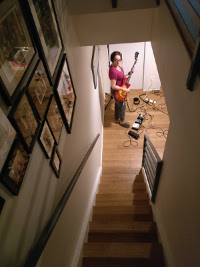
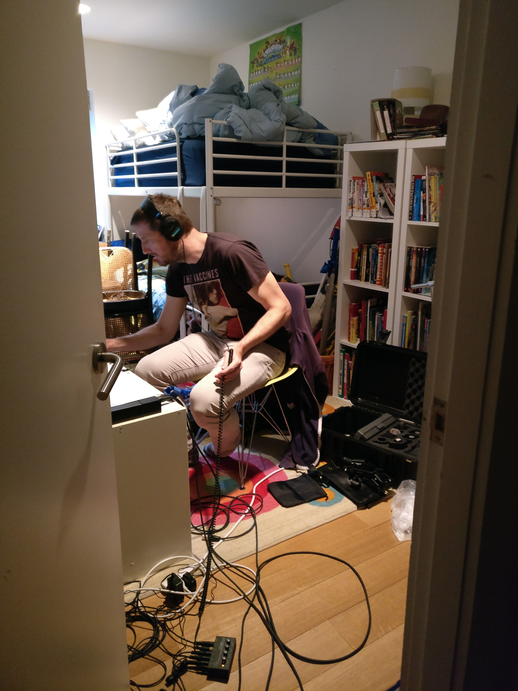
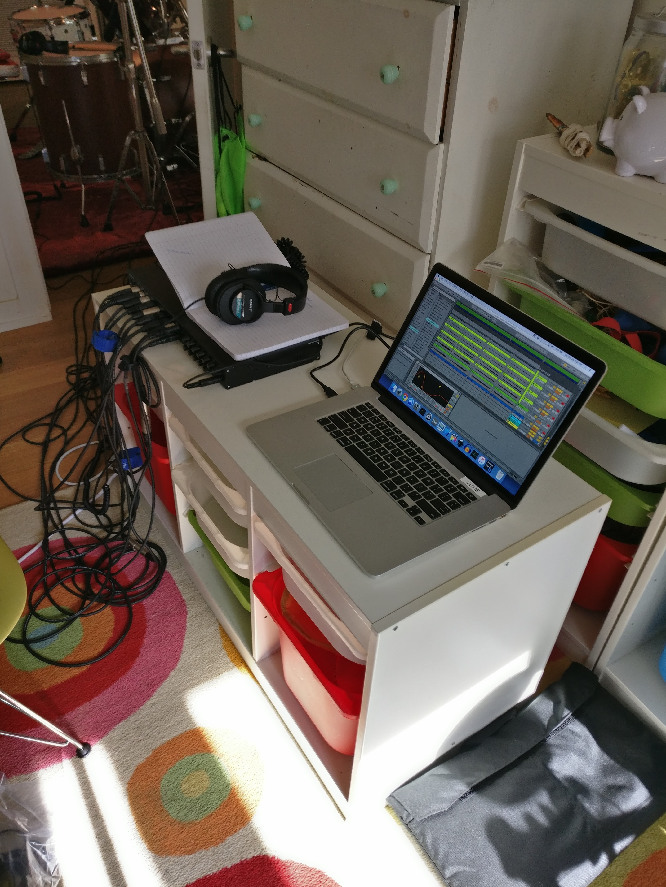

This weekend my band, [Giant Gowanus](http://giantgowan.us/), recorded in my downstairs hallway with the help of our friend || fellow [musician](https://open.spotify.com/artist/1rb7dRSPSAEGaOQouEx5Pg) || soul [geek](http://tulrich.com/) >> Thatcher Ulrich.

It's amazing what you can do with some mics, a laptop, Ableton, and a lot of know-how.

Way different than the days of studios, tape, and herculean effort when I recorded with my bands [Sloppy Joe and the Random Rhythm Section](https://www.facebook.com/Sloppy-Joe-and-the-Random-Rhythm-Section-841350822585897/) and [Tanglefoot](https://www.youtube.com/watch?v=wgDQiQhewTY).

In this time when the unintended consequences of tech (see Facebook and Twitter) are threatening our democracy, its nice to have glimmers of what tech can do to democratize tools and information (not fake news) to make creative endeavors possible with very little $$$ or time.

And... it was the most fun I've ever had recording - even when screaming French lady arrived at our doorstop admonishing us to "TURN IT DOWN! YOU ARE MAKING PEOPLE HYSTERICAL!"

Well done.

 

