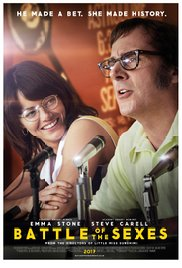
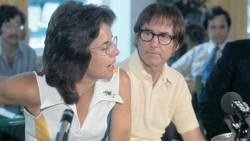

Last night I saw "[Battle of the Sexes](http://www.foxsearchlight.com/battleofthesexes/)":

> In the wake of the sexual revolution and the rise of the women’s movement, the 1973 tennis match between women’s world champion Billie Jean King and ex-men’s-champ and serial hustler Bobby Riggs was billed as the BATTLE OF THE SEXES and became one of the most watched televised sports events of all time, reaching 90 million viewers around the world.


It struck me how far we have come in the fight for LGBTQ rights, and how little we have gained in women's rights since this famous match took place. Especially poignant was a scene where Jack Kramer, tennis champ-turned-tennis promoter, claims women players deserve less prize money—despite drawing the same crowd—[because women are biologically inferior](http://www.slate.com/blogs/browbeat/2017/09/21/battle_of_the_sexes_reminders_of_the_2016_election.html).

#### Sound familiar?

In general, the movie is a reminder of the Trump election. [The one where questioning Hillary Clinton's stamina was a favorite talking point of the right](https://www.youtube.com/watch?v=33O7jg50FjE). 

But to put this in the tech world frame - just a month ago - a Google Engineer (and self-appointed sociology guru), [James Damore](https://www.gq.com/story/james-damore-kkk-names), penned a diatribe lampooning Google's efforts to booster gender diversity in its technical ranks.

In it he argues:

> The distribution of preferences and abilities of men and women differ in part due to biological causes and that these differences may explain why we don’t see equal representation of women in tech and leadership.

He goes on to assert that:

> Women on average have more neuroticism (higher anxiety, lower stress tolerance).This may contribute to the higher levels of anxiety women report on Googlegeist and to the lower number of women in high stress jobs.

I read the entire [memo](https://gizmodo.com/exclusive-heres-the-full-10-page-anti-diversity-screed-1797564320/amp), and it is all over the place. He makes many disclaimers to the effect of "I don't believe in discrimination", while littering it with tired sexist tropes used as tools to keep women out of career tracks cherished by men.

#### First of all, WTF? Women have lower stress tolerance? Really?

1. Women carry and deliver babies. If that is not stressful, I don't know what is.
2. Women are the primary care-givers and head of households in our country.
3. Women have been subjected to rape, abuse, misogyny, and general subjugation for millennia. 

And, yet, we not only survive, but get stronger. 

#### Second of all, since when did being a techie become a "stressful" career choice? 

Sure, there are deadlines - and with the current start-up bubble, the tech industry culture skews more toward Wall Street than the geek world I first fell in love with 20 years ago. But stressful? 

* Try being a social worker for kids at risk. 
* Try being a nurse on the front-lines of an emergency room. 
* Or a teacher in a low-income district. 

Guess what. These workforces are primarily filled by women - and are way more stressful than refactoring code. The real difference is they pay less. 

#### The time I met Billie Jean King 



Three years ago, I was speaking at a Geospatial conference. It had been organized my a male colleague who had not only "failed" to mention he was hosting the event, but also never told me that he was seeking speakers. So, of course I submitted my talk and got a slot - much to his chagrin. You see, I threatened him and he was in a battle of his own making to push me out of his way - a common theme for women (and men) in the workplace.

Before I was going to speak, I went to the restroom ([yes, Donald Trump, people have to use the restroom sometimes](https://www.youtube.com/watch?v=1d3C3qrO_8Q)). On my way, I saw coming toward me Ms. King. Despite the fact that I screamed, "Billie Jean King! I love you!", she engaged with me and we chatted for the next 10 minutes. 

I thanked her for coming out way back in the early 80's - her response: 

	Ugh, that was rough. 
	
She asked me what I was doing and I told her I worked in tech and was giving a talk - her response:

	Good for you! We need more women in tech!
	
I ran into her a few more times that day and when she saw me she would shout:

	Hey tech girl!
	
I've tweaked Billie Jean King's nickname from ```tech girl``` to ```TechMatron``` as a moniker I can own.
	
After seeing the movie last night, I wish I could go back to that encounter and thank her again - but this time for fighting to keep her seat at the table for something she loved. 

It reminds me that while working toward women's equality and access to opportunities in traditionally (and guarded) male roles, we should always expect a fight. And this requires, courage, determination... and, yes, stamina. 

 

