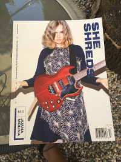

### She Shreds

I just got my new issue of [She Shreds](http://sheshredsmag.com/). 

Man, I wish they had this magazine out when I was 15. Instead, this was typically how women were represented in the high testosterone world of electric guitars. And, well, it was the 80's.

The fact that [a group of women](http://sheshredsmag.com/about/) are publishing this makes me super happy. There are little she shredders getting planted and watered all over the world!

If you are a woman in music - support this magazine and [subscribe](https://shop.sheshredsmag.com/products/subscribe)!